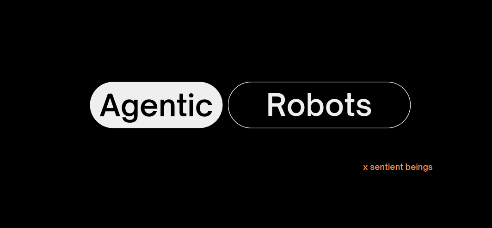

[](http://makeapullrequest.com)
[](http://www.firsttimersonly.com/)

## Agentic Workflow for Robotics 

[Sentient Beings](https://sentient-beings.github.io/) is a open-source organization that is on a mission to build agentic robots. Each project in this organization is designed to be self-contained and we do that by creating a docker container for each project. That includes the dependencies and source code for that project. This helps us get around the "works on my machine" problem.

## Getting Started
This repository contains the idea and code behind the development of the Agentic Robot with Memory, a RAG based system for robots.

### Pre requisites
* [Install Docker Engine](https://docs.docker.com/engine/install/)
* Also make sure that you [add yourself to the docker group to run the containers without needing sudo](https://docs.docker.com/engine/install/linux-postinstall/)
* If you have a NVIDIA GPU, make sure you are using the official NVIDIA drivers and install the [Nvidia Container Toolkit](https://docs.nvidia.com/datacenter/cloud-native/container-toolkit/latest/install-guide.html) 
* Allow X server connections from the container by running 
`xhost +local:docker` on the host machine. You might want to add this command to your .bashrc
* Install [VS Code](https://code.visualstudio.com/docs/setup/linux) and install the [Dev Container Extension](https://marketplace.visualstudio.com/items?itemName=ms-vscode-remote.remote-containers)

### Setup the directory structure
* Each project should have a separate directory
* Clone this repository into the project directory

    ```
    project-directory
    ├── .devcontainer
    ├── util
    │   └── container_scripts
    ├── ws
        └── src
            └── all_packages
    ```
### Build the container
* All you have to do is to open the project directory in VS Code.
* You will be prompted to reopen the workspace in a container. Say yes to this.
* Wait for the container to build. This will take a while the first time, but the container will be cached so it will be faster the next time.


You are all set up and ready to go 🚀

Now, head over to the `docs` folder for details about the project.

