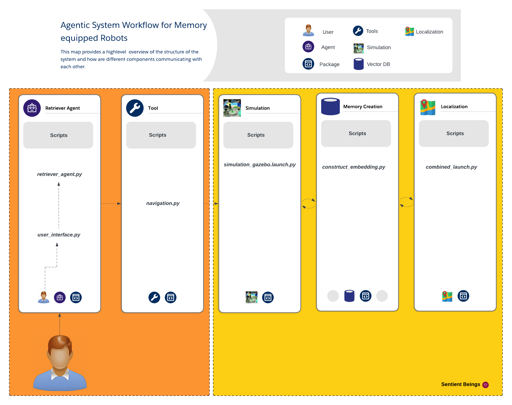

# Agentic System with Memory for Robots: Overview

This document outlines an agentic system that incorporates memory capabilities into differential drive robots, enhancing their autonomous navigation and environmental interaction. The system comprises three main components: Memory Creation, Autonomous Navigation, and User Interface.

## Deployment Process

1. Connect to the robot and verify localization.
2. Initiate memory creation through autonomous exploration or teleoperation.
3. Begin autonomous navigation using the created memory.
4. Interact with the robot via the user interface to navigate to stored locations.

## 1. Memory Creation

Script: `ws/src/construct_memory/construct_embedding.py`

### Data Collection and Processing

- Visual data from cameras
- Odometry data
- Camera data is processed, captioned, and stored with odometry data and timestamps as "memory chunks"

### Memory Consolidation

- Embed memory chunks and store in a vector database

## 2. Autonomous Navigation

Script: `ws/src/retriever/launch/navigation.py`

The navigation stack serves as a tool for the retriever agent to input goal locations.

## Integration Benefits

- Efficient navigation based on past experiences
- Continuous memory updates for improved performance
- Complex task execution by combining remembered skills and environmental knowledge

This integrated approach enables the development of robots that learn from experiences, resulting in more intelligent and adaptable autonomous systems.

## Future Expansions

- Extend compatibility to other robot types
- Incorporate additional sensors:
  - LiDAR or depth sensors for spatial data
  - Joint position sensors
  - Tactile sensors
